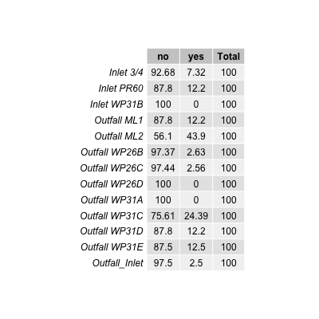
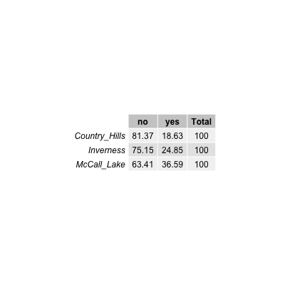
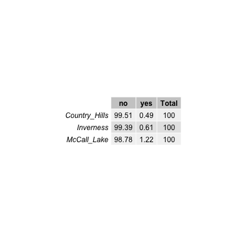

```{r}
#load clean data
clean_water_quality_data <- readRDS("../../data/processed_data/clean_water_quality_data.rds")
```


# Introduction
Although there is an abundance of literature on enteric bacterial pathogens in water systems, there is a lack of data on their presence in urban stormwater. Poor water quality within urban stormwater-impacted bodies of water represents a potentially important public health problem, as many of these water bodies are subjected to chronic issues with human and animal sources of fecal contamination, inferring the potential for zoonotic and anthropogenic enteric bacterial pathogens to be present. Pathogens as Arcobacter butzleri [@Douidah2011] [@Van_Driesche2008] [@Levican2013] [Hafliger2000] [@Craun2005], and other enteric bacterial pathogens (e.g., Campylobacter spp., Salmonella spp., Shiga-toxin producing E. coli) [@Moore2001] [@Krometis2010] [@Rangel2005] [@Adams2016], have all been implicated in waterborne outbreaks throughout the world. Rain events mobilize and transport fecal pathogen in the environment thereby increasing the effects of non-point and point sources of contamination, which in turn can augment the risk to public health [@Staley2018].
Stormwater-impacted bodies of water can serve as reservoirs for transmission for enteric bacterial pathogens by the fecal-oral route through ingestion of contaminated water during recreational activities (e.g., swallowing water while swimming); by way of contaminated irrigation water on food that is then eaten; or by accidental ingestion that occurs during irrigation. An outbreak of HUS associated with a recreational water body in Connecticut, USA, occurred where STEC was detected in a storm drain that emptied onto the beach [@McCarthy2001]. In a study of stormwater discharges and gastrointestinal illness following wet weather in California, USA, [@Soller2017] that wet weather exposure during surfing lead to higher than average illness rates due to human enteric viruses. In addition, they observed Campylobacter spp. above the method detection limit in over half of their samples from stormwater discharges. [@Meng2018] identified Campylobacter spp. in stormwater constructed wetlands intended for reuse activities, and found the concentrations to be similar between wet and dry weather events. Furthermore, they found that log reduction targets for reuse activities were not being met [@Meng2018].
The Arcobacter genus was created in 1991 in an effort to accommodate aero-tolerant Campylobacter spp. [@Vandenberg2004]. Arcobacter spp. are gram-negative, curved bacteria [@Van_Driesche2008]. Currently, there are 22 species [@Van_Driesche2008]. Potential sources of Arcobacter spp. include humans, birds, and livestock. This genus has been characterized as a potential food or waterborne pathogen; and has been implicated in causing human disease, with such symptoms as bacteremia, diarrhea, and gastroenteritis from three species: A. butzleri, A. cryaerophilus, and A. skirrowii [@Kayman2012]. A. butzleri contains the ability to survive and grow in the environment. Further, it can survive at lower temperatures (15-30˚C) than Campylobacter spp.; and can grow in the presence of oxygen [@Van_Driesche2008] [@Wesley2000]. Arcobacter spp. are considered a zoonotic pathogen, and one study identified it as the fourth most frequent bacteria isolated from humans with acute enteric disease [@Levican2013]. 
The objective this study was to identify and determine the prevalence of the putative enteric bacterial pathogen Arcobacter butzleri in urban stormwater ponds located in western Canada, as there is currently limited information as to the critical role of enteric bacterial pathogens, in particular A. butzleri,  in outbreaks associated with stormwater reuse.


# Illustrating setup
_This section is only there to show how to insert results from other places in the project and how to cite figures and other references. Delete this whole section at some point._


Figure \@ref(fig:resultfigure) shows a result figure from the analysis.

```{r resultfigure,  fig.cap='Analysis figure.', echo=FALSE}
knitr::include_graphics("../../results/resultfigure.png")
```

Table \@ref(tab:resulttable) shows a result table from the analysis.

```{r resulttable,  echo=FALSE}
resulttable=readRDS("../../results/resulttable.rds")
knitr::kable(resulttable, caption = 'Result Table.')
```


Note that this cited reference will show up at the end of the document, the reference formatting is determined by the CSL file specified in the YAML header. Many more style files for almost any journal [are available](https://www.zotero.org/styles). You also specify the location of your bibtex reference file in the YAML. You can call your reference file anything you like, I just used the generic word `references.bib` but giving it a more descriptive name is probably better.


# Introduction (required for part 1)

## General Background Information
_Provide enough background on your topic that others can understand the why and how of your analysis_ 
Water reuse provides countries with a strategy to address the growing demands on water resources due to climate change, industrial changes, and projected population growth. However, water reuse poses a variety of challenges. In particular, stormwater has the potential  to be of low water quality, to be contaminated with human and animal feces, and thus enteric bacterial pathogens including Campylobacter spp., Salmonella spp., and pathogenic E. coli. In this project we aim to better understand the relationship between the presence of the putative enteric bacterial pathogen Arcobacter butzleri and other water quality indicators and risk factors, as the contamination of water with human waste, and thus microbial pathogens, poses a significant threat to public health. Furthermore, other studies have shown the presence of other enterical bacterial pathogen (i.e., Campylobacter spp, Salmonella spp.) but this study is the first of its kind to indicate the presence of A. butzleri. 

## Description of data and data source
_Describe what the data is, what it contains, where it is from, etc._
This data was collected over the course of one sampling season (May-September 2017, when the water is not frozen) from select stormwater ponds in Alberta, Canada. Samples were taken biweekly over 21 weeks to catch any temporal trends that may occur. The focus of this project will be on one specific pathogen putative enteric bacterial pathogen, Arcobacter butzleri, and its relationship to other water quality indicators (i.e., E. coli and Enterococcus) and microbial sources of pollution tested (i.e., Human, Dog, Muskrat, Ruminant, Birds, and Canadian Goose). 
Water quality indicator data is from culture based methods.
Microbial source tracking and pathogen data is from molecular based methods.
We will find this data that many times there is no value, so "do not detect is assigned." These are important to keep as even though nothing is detected we cannot technically assign these as a value of 0, because we cannot definately say that nothing is there. 

I generated this data as part of my master of science degree. None of this data has been published. I am hoping to generate publishable figures in this class for a publication focusing on A. butzleri in urban stormwater ponds.

There are 5621 observations for 25 variables.
## Questions/Hypotheses to be addressed
_State the research questions you plan to answer with this analysis_
1. Do we see a relationship between human fecal contamination (HF183 and HumM2) and A. butzleri?
2. Do we see a realtionship between bird fecal contaminaion (LeeSg and CGO1) and A. butzleri?
3. Do we see an increase in the levels of A. butzleri during times of rainfall?
4. Do we see a relationship between traditional water quality indicators (E. coli and Enterococcus) and A. butzleri?
5. Are certain sampling locations or sites more prone to A. butlzeri contamination? 
6. Are other enteric pathogens found when A. butzleri is also found?

#Outcomes of interest
There are several outcomes of interest for this project. Foremost, A. butzleri is a putative pathogen. Showing if it has relationship with human fecal material will help to establish its importance, as human fecal material is a risk factor for illness in recreational bodies of water. Further, water quality indicators are supposed to be indicators for pathogens such as A. butzleri. I would like to test how accurate that is. 

#Brief overview of data
```{r}
library(RCurl)
data <- getURL("https://raw.githubusercontent.com/epid8060fall2019/MeganBeaudry-Project_WQ/master/data/raw_data/9-19-19%20raw%20data%20epid%20project.csv")
dataWQ <- read.csv(text = data)
str(dataWQ)
```


# Materials and Methods
Sampling: To determine what select enteric bacterial pathogens present, stormwater samples were collected from stormwater ponds southern Alberta, Canada. Semiweekly sampling began as soon as stormwater ponds were fully thawed (i.e., May 9th, 2017), and ended just before freezing (i.e., September 25th, 2017) at three stormwater ponds in Calgary, Alberta, Canada: McCall Lake, Country Hills Stormwater Facility, and Inverness Stormpond. At each pond, four (i.e., McCall Lake and Inverness) or five (i.e., Country Hills) locations were sampled 41 times. During sampling, 500 mL of water was collected into two sterile 250 mL Nalgene polyethylene bottles (Nalgene, Rochester, NY, USA) (Systems Plus, Baden, Ontario, Canada) by hand using sterile gloves. Following collection, were sent for pathogen analysis to the University of Alberta (Edmonton, AB, Canada) within 24 hours.

Culture Methods for Bacterial Water Quality Indicators:
Traditional water quality indicators were analyzed using defined substrate culture methods (IDEXX, Westbrook, ME, USA) for E. coli and total coliform detection using Colilert Quantitray-2000®. All samples were analyzed according to guidelines from the manufacturer. The Quantitrays® (IDEXX, Westbrook, ME, USA) were sealed and incubated for 24 hours at 35˚C. Following incubation, most probable numbers (MPN) were determined by scoring the number of positive wells (Colilert® – yellow wells = total coliforms, yellow and fluorescent = E. coli) and transforming results into quantitative estimates using IDEXX MPN charts. If the Quantitrays® were positive for E. coli, they were set aside for further analysis.
Enumeration of fecal coliform bacteria was performed by the Provincial Laboratory in Calgary, Alberta, Canada, in which water (10 mL) was filtered onto a 15x16 mm membrane that was placed on a Membrane Fecal Coliform (mFC) plate (Dalynn Biological, Calgary, AB, Canada), then incubated at 44.5 ˚C for 24 hours. Fecal coliform bacteria were enumerated according to standard operating procedures for the Provincial Lab of Public Health and in alignment with current practices of recreational water assessment in the province of Alberta, Canada. 

Molecular Methods:
DNA extraction. Immediately upon receipt of stormwater samples in the laboratory, 20 mL of water was filtered onto 0.4 micron polycarbonate filters by EPA method 1611 (Environmental Protection Agency, 2012) by the Provincial Laboratory in Calgary. Filters were then stored at -80˚C until they were shipped to Edmonton, Alberta, Canada on dry ice. 
Controls.  In order to ensure amplification, plasmids or positive samples were used as positive controls. IAC was used as a control. DNA free water was used as a negative control, prepared in the same manner as water samples to ensure no carryover.
qPCR Assays. qPCR assays included targets for bacterial indicators (i.e., Enterococcus spp.), microbial source tracking markers (i.e., human, cattle, seagull, goose, dog, and muskrat), as well bacterial pathogen-related genes (i.e., Campylobacter spp., Salmonella spp., and A. butzleri). Two markers were used for human contamination to ensure that the results were not due to cross-reaction with other fecal sources (e.g., dog, turkey, and chickens)[@Green2014]. Each marker has a different limit of detection as assayed previously in the laboratory. Each assay target species, target locus, and primer/probe names and their corresponding sequences are specified.
Amplification was performed on an Applied Biosystems TaqMan 7500 fast real-time PCR system (Applied Biosystems, Foster City, CA, USA). The reaction mixture was made to a final volume of 20 µL. The calibrator control standards and plasmid controls were performed in triplicate. The negative controls, Enterococcus spp., and salmon DNA PCR assays were performed in duplicate. Sample assays were only performed once. All reactions were carried out in a MicroAmp Fast Optical 96-Well Reaction Plate (Applied Biosystems, Foster City, CA, USA). Samples were pulsed down at maximum speed in a centrifuge prior to thermal cycling. Thermal cycling conditions were 50°C for two minutes; 95°C for 30 seconds (holding); followed by 45 cycles of 95°C for three seconds; and 60°C for 30 seconds for all assays, except for the muskrat marker MuBac. The annealing temperature of MuBac was 57°C. The threshold cycle (CT) was set at 0.1 for Entero1 and Sketa, and 0.05 for all other targets. For further analysis, all CT values were entered into Microsoft Excel.
DNA plasmid standards for each assay were developed previously in the laboratory. Briefly, DNA targets were PCR amplified, run on a 2% agarose gels and amplicons extracted by a QIAquick (Qiagen, Hilden, Germany) gel extraction kit. The products were cloned into pCR2.1-TOPO (Thermo Fisher Scientific, Waltham, MA, USA) per manufacturer’s instructions using TOP10 F’ E. coli competent cells. The plasmids were mini-prepped using QIAprep spin mini prep kit (Qiagen, Hilden, Germany). Plasmids were then quantitated using the Qubit 2.0 fluorimeter (Invitrogen Carlsbad, CA, USA) and diluted to 100,000 copies/µL stocks. Thus, stocks of plasmid DNA were aliquoted and stored at -80°C. During each qPCR analysis, 10-fold serial dilutions were made from the known concentration plasmid for each individual target.
For further analysis, all CT values were entered into Microsoft Excel and volume corrected pior to data analysis using R statstical software. 


## Data import and cleaning
The data was cleaned to format the variables (e.g., DNQ, not detects, >2419.6) in order to deal with limits of detection and detection limits . In the raw data, detectable but not quantifiable (DNQ) had not been assigned a value. See supplementary material - cleaning. 

#Results
*Your report should be more detailed than what would normally go into a peer reviewed paper. Include parts such as results from your exploratory analysis. Those can be part of the main document or if you prefer a separate supplementary document.*
*-----* = TABLE/FIGURE NUMBER


## Univariate analysis
A high-level descriptive overview of the bacteriological water quality in each of these ponds, and at each of the sites, is provided in *-----*, and is based on the percentage of samples violating water quality standards/guidelines, as evaluated against: the USEPA’s recreational water quality guideline for Enterococcus by molecular methods (Environmental Protection Agency, 2012); and Alberta’s former recreational water quality standards based on thermotolerant coliform concentrations (*-----*).  A number of observations are worth noting from this high-level analysis. 
```{r}
knitr::include_graphics("../../results/entero_pond_table.png")
knitr::include_graphics("../../results/thermo_pond_table.png")
```

Firstly, considerable spatial variation was observed with respect to the frequency of water quality failures among the urban stormwater ponds, with McCall Lake appearing to be the most contaminated of the three storm ponds. This result was true regardless of the bacterial water quality indicator chosen for analysis (i.e., Enterococcus or thermotolerant coliforms). Approximately 29% of all water samples taken at McCall Lake failed water quality guidelines for Enterococcus at the recommended STV or geomean values set out in the guidance documents (*____*). Inverness Stormpond had the fewest water quality violations among the three ponds, also based on all bacteriological indicators examined, and therefore was considered to have the best water quality overall.

```{r}
knitr::include_graphics("../../results/entero_y_n_site_table.png")

```

However, variation in bacteriological water quality was also observed among sampling sites within a single pond. The most contaminated site across all stormwater ponds examined was site ML2 at McCall Lake, with upwards of 51% of all samples failing the US EPAs Guidelines for Recreational Water Quality for Enteroccus spp. STV (*___*). This site had the poorest water quality irrespective of the bacterial indicator used in the analysis.  It is important to note, however, that ML2 was an above-grade outfall (*___ and ___*), thereby potentially explaining the more frequent bacteriological failures at this site as due to the fact that water samples were directly collected from the outfall and not after dilution into the pond.

Bacteriological water quality indicators were further assessed for all sampling sites (see univariate code), however due to the poor water quality at McCall Lake this assessment is included in the report.
```{r}
knitr::include_graphics("../../results/McCall_WQ_plots.png")
```


A high-level descriptive overview of the frequency of several enteric bacterial pathogens (i.e., A. butzleri, Campylobacter spp., Salmonella spp., and STEC) in each of the Calgary urban stormwater ponds (i.e., McCall Lake, Country Hills Stormwater Facility, and Inverness Stormpond), and at each sampling site within the ponds is provided in *-----*. The most frequently detected bacterial pathogen found in stormwater ponds was A. butzleri, detected in 36% of samples at McCall Lake, 24% of samples at Inverness and 18% of samples at Country Hills (*-----*). The second most common pathogen detected was Campylobacter spp. (4% at Country Hills) and Salmonella spp. (1% at McCall Lake) (*-----*). 

```{r resultfigure,  fig.cap='Analysis figure.', echo=FALSE}



```

_Use a combination of text/tables/figures to explore and describe your data. You should produce plots or tables or other summary quantities for most of your variables. You definitely need to do it for the important variables, i.e. if you have main exposure or outcome variables, those need to be explored. Depending on the total number of variables in your dataset, explore all or some of the others._

## Bivariate analysis
_Create plots or tables and compute simple statistics (e.g. t-tests, simple regression model with 1 predictor, etc.) to look for associations between your outcome(s) and each individual predictor variable_


## Full analysis
_Use one or several suitable statistical/machine learning methods to analyze your data and to produce meaningful figures, tables, etc. This might again be code that is best placed in one or several separate R scripts that need to be well documented. You can then load the results produced by this code_

# Discussion

## Summary and Interpretation
_Summarize what you did, what you found and what it means._

## Strengths and Limitations
_Discuss what you perceive as strengths and limitations of your analysis._

## Conclusions
_What are the main take-home messages?_


_Include citations in your Rmd file using bibtex, the list of references will automatically be placed at the end_

# References

