```{r}
#load clean data
clean_water_quality_data <- readRDS("../../data/processed_data/clean_water_quality_data.rds")
```

*Q for Dr. Handel*
Hi Dr. Handel,
I have produced a lot of figures, tables and models. I have only included the ones in this document that help to tell "story" about the water quality in these urbran stormwater ponds. This is still more information than I would include in a publication on this topic. Please me know what comments and suggestions you have, or if you think I am lacking information you expected us to have in the project. I am looking forward to receving some feedback from you. 
Thank you,
Megan


# Introduction
Although there is an abundance of literature on enteric bacterial pathogens in water systems, there is a lack of data on their presence in urban stormwater. Poor water quality within urban stormwater-impacted bodies of water represents a potentially important public health problem, as many of these water bodies are subjected to chronic issues with human and animal sources of fecal contamination, inferring the potential for zoonotic and anthropogenic enteric bacterial pathogens to be present. Pathogens as Arcobacter butzleri [@Douidah2011] [@Van_Driesche2008] [@Levican2013] [@Hafliger2000] [@Craun2005], and other enteric bacterial pathogens (e.g., Campylobacter spp., Salmonella spp., Shiga-toxin producing E. coli) [@Moore2001] [@Krometis2010] [@Rangel2005] [@Adams2016], have all been implicated in waterborne outbreaks throughout the world. Rain events mobilize and transport fecal pathogen in the environment thereby increasing the effects of non-point and point sources of contamination, which in turn can augment the risk to public health [@Staley2018].
Stormwater-impacted bodies of water can serve as reservoirs for transmission for enteric bacterial pathogens by the fecal-oral route through ingestion of contaminated water during recreational activities (e.g., swallowing water while swimming); by way of contaminated irrigation water on food that is then eaten; or by accidental ingestion that occurs during irrigation. An outbreak of HUS associated with a recreational water body in Connecticut, USA, occurred where STEC was detected in a storm drain that emptied onto the beach [@McCarthy2001]. In a study of stormwater discharges and gastrointestinal illness following wet weather in California, USA, [@Soller2017] that wet weather exposure during surfing lead to higher than average illness rates due to human enteric viruses. In addition, they observed Campylobacter spp. above the method detection limit in over half of their samples from stormwater discharges. [@Meng2018] identified Campylobacter spp. in stormwater constructed wetlands intended for reuse activities, and found the concentrations to be similar between wet and dry weather events. Furthermore, they found that log reduction targets for reuse activities were not being met [@Meng2018].
The Arcobacter genus was created in 1991 in an effort to accommodate aero-tolerant Campylobacter spp. [@Vandenberg2004]. Arcobacter spp. are gram-negative, curved bacteria [@Van_Driesche2008]. Currently, there are 22 species [@Van_Driesche2008]. Potential sources of Arcobacter spp. include humans, birds, and livestock. This genus has been characterized as a potential food or waterborne pathogen; and has been implicated in causing human disease, with such symptoms as bacteremia, diarrhea, and gastroenteritis from three species: A. butzleri, A. cryaerophilus, and A. skirrowii [@Kayman2012]. A. butzleri contains the ability to survive and grow in the environment. Further, it can survive at lower temperatures (15-30˚C) than Campylobacter spp.; and can grow in the presence of oxygen [@Van_Driesche2008] [@Wesley2000]. Arcobacter spp. are considered a zoonotic pathogen, and one study identified it as the fourth most frequent bacteria isolated from humans with acute enteric disease [@Levican2013]. 
The objective this study was to identify and determine the prevalence of the putative enteric bacterial pathogen Arcobacter butzleri in urban stormwater ponds located in western Canada, as there is currently limited information as to the critical role of enteric bacterial pathogens, in particular A. butzleri,  in outbreaks associated with stormwater reuse. Furthermore, we sought to resolve the source of the enteric bacterial pathogens by using microbial source tracking techniques and analyzing environmental parameters.


Note that this cited reference will show up at the end of the document, the reference formatting is determined by the CSL file specified in the YAML header. Many more style files for almost any journal [are available](https://www.zotero.org/styles). You also specify the location of your bibtex reference file in the YAML. You can call your reference file anything you like, I just used the generic word `references.bib` but giving it a more descriptive name is probably better.


# Introduction (required for part 1)

## General Background Information
_Provide enough background on your topic that others can understand the why and how of your analysis_ 
Water reuse provides countries with a strategy to address the growing demands on water resources due to climate change, industrial changes, and projected population growth. However, water reuse poses a variety of challenges. In particular, stormwater has the potential  to be of low water quality, to be contaminated with human and animal feces, and thus enteric bacterial pathogens including Campylobacter spp., Salmonella spp., and pathogenic E. coli. In this project we aim to better understand the relationship between the presence of the putative enteric bacterial pathogen Arcobacter butzleri and other water quality indicators and risk factors, as the contamination of water with human waste, and thus microbial pathogens, poses a significant threat to public health. Furthermore, other studies have shown the presence of other enterical bacterial pathogen (i.e., Campylobacter spp, Salmonella spp.) but this study is the first of its kind to indicate the presence of A. butzleri. 

## Description of data and data source
_Describe what the data is, what it contains, where it is from, etc._
This data was collected over the course of one sampling season (May-September 2017, when the water is not frozen) from select stormwater ponds in Alberta, Canada. Samples were taken biweekly over 21 weeks to catch any temporal trends that may occur. The focus of this project will be on one specific pathogen putative enteric bacterial pathogen, Arcobacter butzleri, and its relationship to other water quality indicators (i.e., E. coli and Enterococcus) and microbial sources of pollution tested (i.e., Human, Dog, Muskrat, Ruminant, Birds, and Canadian Goose). 
Water quality indicator data is from culture based methods.
Microbial source tracking and pathogen data is from molecular based methods.
We will find this data that many times there is no value, so "do not detect is assigned." These are important to keep as even though nothing is detected we cannot technically assign these as a value of 0, because we cannot definately say that nothing is there. 

I generated this data as part of my master of science degree. None of this data has been published. I am hoping to generate publishable figures in this class for a publication focusing on A. butzleri in urban stormwater ponds.

There are 5621 observations for 25 variables.
## Questions/Hypotheses to be addressed
_State the research questions you plan to answer with this analysis_
1. Do we see a relationship between human fecal contamination (HF183 and HumM2) and A. butzleri?
2. Do we see a realtionship between bird fecal contaminaion (LeeSg and CGO1) and A. butzleri?
3. Do we see an increase in the levels of A. butzleri during times of rainfall?
4. Do we see a relationship between traditional water quality indicators (E. coli and Enterococcus) and A. butzleri?
5. Are certain sampling locations or sites more prone to A. butlzeri contamination? 
6. Are other enteric pathogens found when A. butzleri is also found?

#Outcomes of interest
There are several outcomes of interest for this project. Foremost, A. butzleri is a putative pathogen. Showing if it has relationship with human fecal material will help to establish its importance, as human fecal material is a risk factor for illness in recreational bodies of water. Further, water quality indicators are supposed to be indicators for pathogens such as A. butzleri. I would like to test how accurate that is. 

#Brief overview of data
```{r}
library(RCurl)
data <- getURL("https://raw.githubusercontent.com/epid8060fall2019/MeganBeaudry-Project_WQ/master/data/raw_data/9-19-19%20raw%20data%20epid%20project.csv")
dataWQ <- read.csv(text = data)
str(dataWQ)
```


# Materials and Methods
Sampling: To determine what select enteric bacterial pathogens present, stormwater samples were collected from stormwater ponds southern Alberta, Canada. Semiweekly sampling began as soon as stormwater ponds were fully thawed (i.e., May 9th, 2017), and ended just before freezing (i.e., September 25th, 2017) at three stormwater ponds in Calgary, Alberta, Canada: McCall Lake, Country Hills Stormwater Facility, and Inverness Stormpond. At each pond, four (i.e., McCall Lake and Inverness) or five (i.e., Country Hills) locations were sampled 41 times. During sampling, 500 mL of water was collected into two sterile 250 mL Nalgene polyethylene bottles (Nalgene, Rochester, NY, USA) (Systems Plus, Baden, Ontario, Canada) by hand using sterile gloves. Following collection, were sent for pathogen analysis to the University of Alberta (Edmonton, AB, Canada) within 24 hours.

Culture Methods for Bacterial Water Quality Indicators:
Traditional water quality indicators were analyzed using defined substrate culture methods (IDEXX, Westbrook, ME, USA) for E. coli and total coliform detection using Colilert Quantitray-2000®. All samples were analyzed according to guidelines from the manufacturer. The Quantitrays® (IDEXX, Westbrook, ME, USA) were sealed and incubated for 24 hours at 35˚C. Following incubation, most probable numbers (MPN) were determined by scoring the number of positive wells (Colilert® – yellow wells = total coliforms, yellow and fluorescent = E. coli) and transforming results into quantitative estimates using IDEXX MPN charts. If the Quantitrays® were positive for E. coli, they were set aside for further analysis.
Enumeration of fecal coliform bacteria was performed by the Provincial Laboratory in Calgary, Alberta, Canada, in which water (10 mL) was filtered onto a 15x16 mm membrane that was placed on a Membrane Fecal Coliform (mFC) plate (Dalynn Biological, Calgary, AB, Canada), then incubated at 44.5 ˚C for 24 hours. Fecal coliform bacteria were enumerated according to standard operating procedures for the Provincial Lab of Public Health and in alignment with current practices of recreational water assessment in the province of Alberta, Canada. 

Molecular Methods:
DNA extraction. Immediately upon receipt of stormwater samples in the laboratory, 20 mL of water was filtered onto 0.4 micron polycarbonate filters by EPA method 1611 (Environmental Protection Agency, 2012) by the Provincial Laboratory in Calgary. Filters were then stored at -80˚C until they were shipped to Edmonton, Alberta, Canada on dry ice. 
Controls.  In order to ensure amplification, plasmids or positive samples were used as positive controls. IAC was used as a control. DNA free water was used as a negative control, prepared in the same manner as water samples to ensure no carryover.
qPCR Assays. qPCR assays included targets for bacterial indicators (i.e., Enterococcus spp.), microbial source tracking markers (i.e., human, cattle, seagull, goose, dog, and muskrat), as well bacterial pathogen-related genes (i.e., Campylobacter spp., Salmonella spp., and A. butzleri). Two markers were used for human contamination to ensure that the results were not due to cross-reaction with other fecal sources (e.g., dog, turkey, and chickens)[@Green2014]. Each marker has a different limit of detection as assayed previously in the laboratory. Each assay target species, target locus, and primer/probe names and their corresponding sequences are specified.
Amplification was performed on an Applied Biosystems TaqMan 7500 fast real-time PCR system (Applied Biosystems, Foster City, CA, USA). The reaction mixture was made to a final volume of 20 µL. The calibrator control standards and plasmid controls were performed in triplicate. The negative controls, Enterococcus spp., and salmon DNA PCR assays were performed in duplicate. Sample assays were only performed once. All reactions were carried out in a MicroAmp Fast Optical 96-Well Reaction Plate (Applied Biosystems, Foster City, CA, USA). Samples were pulsed down at maximum speed in a centrifuge prior to thermal cycling. Thermal cycling conditions were 50°C for two minutes; 95°C for 30 seconds (holding); followed by 45 cycles of 95°C for three seconds; and 60°C for 30 seconds for all assays, except for the muskrat marker MuBac. The annealing temperature of MuBac was 57°C. The threshold cycle (CT) was set at 0.1 for Entero1 and Sketa, and 0.05 for all other targets. For further analysis, all CT values were entered into Microsoft Excel.
DNA plasmid standards for each assay were developed previously in the laboratory. Briefly, DNA targets were PCR amplified, run on a 2% agarose gels and amplicons extracted by a QIAquick (Qiagen, Hilden, Germany) gel extraction kit. The products were cloned into pCR2.1-TOPO (Thermo Fisher Scientific, Waltham, MA, USA) per manufacturer’s instructions using TOP10 F’ E. coli competent cells. The plasmids were mini-prepped using QIAprep spin mini prep kit (Qiagen, Hilden, Germany). Plasmids were then quantitated using the Qubit 2.0 fluorimeter (Invitrogen Carlsbad, CA, USA) and diluted to 100,000 copies/µL stocks. Thus, stocks of plasmid DNA were aliquoted and stored at -80°C. During each qPCR analysis, 10-fold serial dilutions were made from the known concentration plasmid for each individual target.
For further analysis, all CT values were entered into Microsoft Excel and volume corrected pior to data analysis using R statstical software. 


## Data import and cleaning
The data was cleaned to format the variables (e.g., DNQ, not detects, >2419.6) in order to deal with limits of detection and detection limits . In the raw data, detectable but not quantifiable (DNQ) had not been assigned a value. See supplementary material - cleaning. 

#Results
*Your report should be more detailed than what would normally go into a peer reviewed paper. Include parts such as results from your exploratory analysis. Those can be part of the main document or if you prefer a separate supplementary document.*
*-----* = TABLE/FIGURE NUMBER


## Water quality
A high-level descriptive overview of the bacteriological water quality in each of these ponds, and at each of the sites, is provided in *-----*, and is based on the percentage of samples violating water quality standards/guidelines, as evaluated against: the USEPA’s recreational water quality guideline for Enterococcus by molecular methods (Environmental Protection Agency, 2012); and Alberta’s former recreational water quality standards based on thermotolerant coliform concentrations (*-----*).  A number of observations are worth noting from this high-level analysis. 
```{r, warning=FALSE, fig.cap= "Frequency of occurrence of samples positive based on water quality indicator Enterococcus spp. in stormwater ponds in Calgary, Alberta."}
knitr::include_graphics("../../results/entero_pond_table.png")
```

```{r  warning=FALSE, fig.cap= "Frequency of occurrence of samples positive based on the water quality indicator thermotolerant coliforms of stormwater ponds in Calgary, Alberta."}
knitr::include_graphics("../../results/thermo_pond_table.png")
```

Firstly, considerable spatial variation was observed with respect to the frequency of water quality failures among the urban stormwater ponds, with McCall Lake appearing to be the most contaminated of the three storm ponds. This result was true regardless of the bacterial water quality indicator chosen for analysis (i.e., Enterococcus or thermotolerant coliforms). Approximately 29% of all water samples taken at McCall Lake failed water quality guidelines for Enterococcus at the recommended STV or geomean values set out in the guidance documents (*____*). Inverness Stormpond had the fewest water quality violations among the three ponds, also based on all bacteriological indicators examined, and therefore was considered to have the best water quality overall.

```{r  warning=FALSE, fig.cap= "Frequency of occurrence of samples positive based on water quality indicator Enterococcus spp. broken down by sampling site in Calgary, Alberta."}
knitr::include_graphics("../../results/entero_y_n_site_table.png")
```
```{r warning=FALSE, fig.cap= "Frequency of occurrence of samples positive based on water quality indicator thermotolerant colifroms broken down by sampling site in Calgary, Alberta."}
knitr::include_graphics("../../results/thermo_y_n_site_table.png")
```

However, variation in bacteriological water quality was also observed among sampling sites within a single pond. The most contaminated site across all stormwater ponds examined was site ML2 at McCall Lake, with upwards of 51% of all samples failing the US EPAs Guidelines for Recreational Water Quality for Enteroccus spp. STV (*___*). This site had the poorest water quality irrespective of the bacterial indicator used in the analysis.  It is important to note, however, that ML2 was an above-grade outfall (*___ and ___*), thereby potentially explaining the more frequent bacteriological failures at this site as due to the fact that water samples were directly collected from the outfall and not after dilution into the pond.

Bacteriological water quality indicators were further assessed for all sampling sites (see univariate code), however due to the poor water quality at McCall Lake this assessment is included in the report.
```{r warning=FALSE, fig.cap= "Violin  plot of Enterococcus log10 values (top) and scatterplot ofthermotolerant coliforms log10 (bottom) values in McCall Lake Stormwater Facility over 21 weeks broken down by sampling site (i.e., ML2, ML1, PR60, 3/4. The red dotted line respresents the USEPA guidelines for recreational water quality STV (top) and Alberta Environments thermotolerant coliform guideline (below)"}
knitr::include_graphics("../../results/McCall_WQ_plots.png")
```
Median levels of Enterococcus at the ML2 site approximated 3.1 log10 CCE/100 mL, whereas at all other sampling sites in McCall Lake (i.e., ML1, Inlet 3/4, and PR60), the median occurrence was almost an order of magnitude lower (~ 2.3 log10 CCE/100 mL) (*____*). Incidentally, ML2 also had the largest overall interquartile variation in the concentration of Enterococcus during the study season (*---*). Concentrations of thermotolerant coliforms were also high at this site and followed a similar trend to that of Enterococcus (*---*).

It is important to note that in most cases for Enterococcus at sites other than ML2, there were several outliers in the data set (*____*).Although outliers may reflect recent localized contamination events not necessarily reflective of overall water quality in the stormwater pond (e.g., aquatic birds in one area of the pond), their occurrence could also reflect the periods of peak contamination in stormwater ponds, and for which this effect may be contingent on temporal variables associated with water quality (e.g., first flush from storms, to be discussed later). Specifically, outliers for Enterococcus concentrations were represented by values higher than ~3.5 log10 for Inlet 3/4, ~3.75 log10 for ML1, and ~4 log10 for PR60. 

This analysis revealed that stormwater ponds and stormwater-impacted urban rivers in southern Alberta, Canada, do not often meet existing guidelines or standards as laid out by USEPA, Health Canada, and Alberta Environments and Parks in terms of recreational water quality, surface water quality and/or irrigation water quality. For this reason, we sought to determine the potentiasl sources of poor water quality using microbial source tracking assays for humans, ruminants, dogs, gull, geese and muskrat.

Calgary stormwater ponds were mainly impacted by human and gull feces (*below*). The human specific markers, HF183 and HumM2, were detected at 42% and 16%, of samples, respectively in McCall Lake (*below*). On the lower end, they were dtected in 14% and 3% of samples at Inverness. The gull specific marker (i.e., LeeSg) was found in 15% of samples at McCall Lake (*below*). Of these, the more dominant source of fecal pollution was from humans (*below*). All other host-specific markers (i.e., dog, Canada geese, muskrat, and ruminants) were detected in <5% of pond samples (*below*).

```{r warning=FALSE, fig.cap= "Frequency of occurrence of samples positive based on MST marker HF183 for human fecal contamination broken down by sampling site in Calgary, Alberta."}
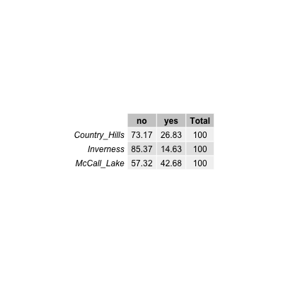
```
```{r warning=FALSE, fig.cap= "Frequency of occurrence of samples positive based on MST marker HuMm2 for human fecal contamination broken down by sampling site in Calgary, Alberta."}

```
```{r warning=FALSE, fig.cap= "Frequency of occurrence of samples positive based on MST marker CG01 for human fecal contamination broken down by sampling site in Calgary, Alberta."}

```

```{r warning=FALSE, fig.cap= "Frequency of occurrence of samples positive based on MST marker LeeSg for human fecal contamination broken down by sampling site in Calgary, Alberta."}
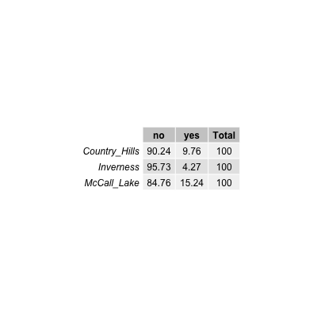
```

```{r warning=FALSE, fig.cap= "Frequency of occurrence of samples positive based on MST marker Dog3 for human fecal contamination broken down by sampling site in Calgary, Alberta."}

```

```{r warning=FALSE, fig.cap= "Frequency of occurrence of samples positive based on MST marker Rum2Bac for human fecal contamination broken down by sampling site in Calgary, Alberta."}
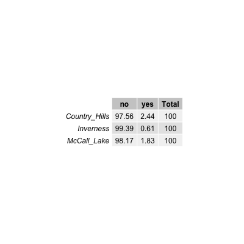
```

```{r warning=FALSE, fig.cap= "Frequency of occurrence of samples positive based on MST marker MuBac for human fecal contamination broken down by sampling site in Calgary, Alberta."}

```


In congruence with finding that ML2 at McCall Lake was the most frequently contaminated site with human feces (*ABOVE TABLE*), this site also had the greatest median concentration of the human fecal marker HF183 (i.e., 4.2 log10 copies/100 mL) observed across all three stormwater ponds and sampling sites in these ponds (*BELOW FIGURE*). In comparison, all other McCall Lake sampling sites had a median concentration of HF183 at ~3.4 log10 copies/100 mL (i.e., close to the quantification limit of the assay (red dotted line)) (*BELOW FIGURE*). Specifically, at ML2, there was a single outlier in the data set for HF183, represented by a value of 6.0 log10 copies/100 mL (*BELOW FIGURE*). However, although ML2 represented the most consistently contaminated sampling site with human fecal contamination at McCall Lake, all other sites in this thesis appeared to be at risk for human fecal contamination (*BELOW FIGURE*). 

```{r warning=FALSE, fig.cap= "Box and Whisker Plot of HF183 levels by sampling site in McCall Lake (ML2 n=38, ML1 n=6, PR60 n=13, Inlet ¾ n= 5). The outer edges of the box represent the 25th and 75th percentiles (i.e., interquartile range), and the line within the box represents the median. The location of median indicates the skew of the data. The whiskers represent the interquartile range*1.5. The outliers are determined by being greater or less than 1.5 times the upper of lower interquartile ranges as represented by circles."}
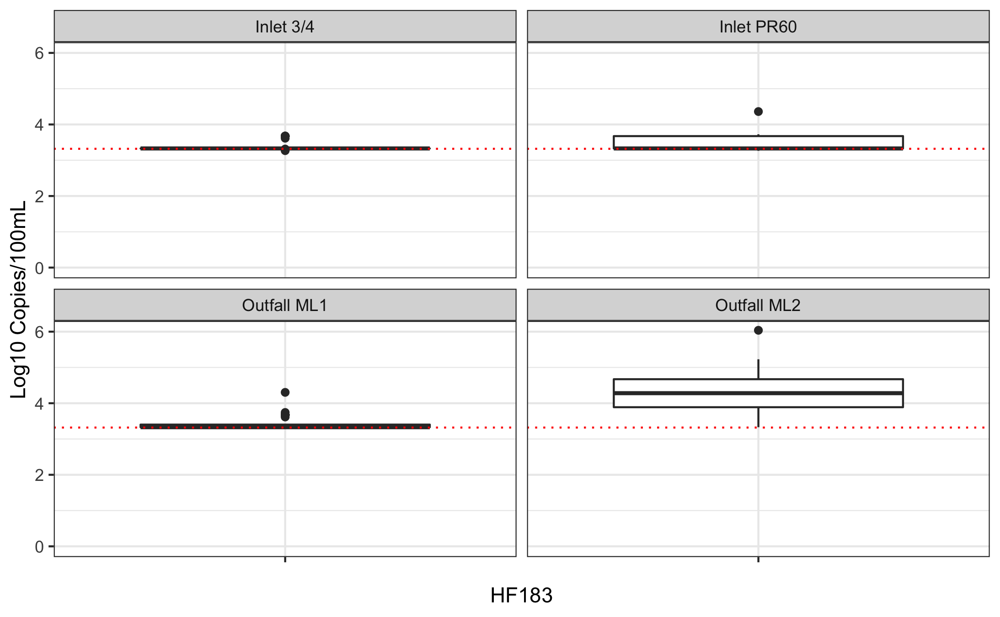
```
```{r warning=FALSE, fig.cap= "Box and Whisker Plot of HF183 levels by sampling site in Country Hills (ML2 n=38, ML1 n=6, PR60 n=13, Inlet ¾ n= 5). The outer edges of the box represent the 25th and 75th percentiles (i.e., interquartile range), and the line within the box represents the median. The location of median indicates the skew of the data. The whiskers represent the interquartile range*1.5. The outliers are determined by being greater or less than 1.5 times the upper of lower interquartile ranges as represented by circles."}
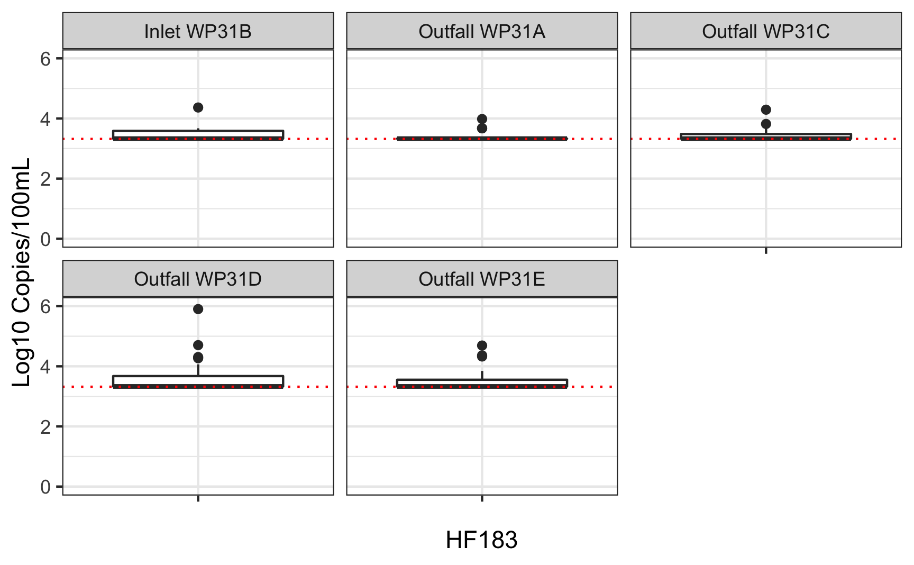
```
```{r warning=FALSE, fig.cap= "Box and Whisker Plot of HF183 levels by sampling site in Inverness (ML2 n=38, ML1 n=6, PR60 n=13, Inlet ¾ n= 5). The outer edges of the box represent the 25th and 75th percentiles (i.e., interquartile range), and the line within the box represents the median. The location of median indicates the skew of the data. The whiskers represent the interquartile range*1.5. The outliers are determined by being greater or less than 1.5 times the upper of lower interquartile ranges as represented by circles."}
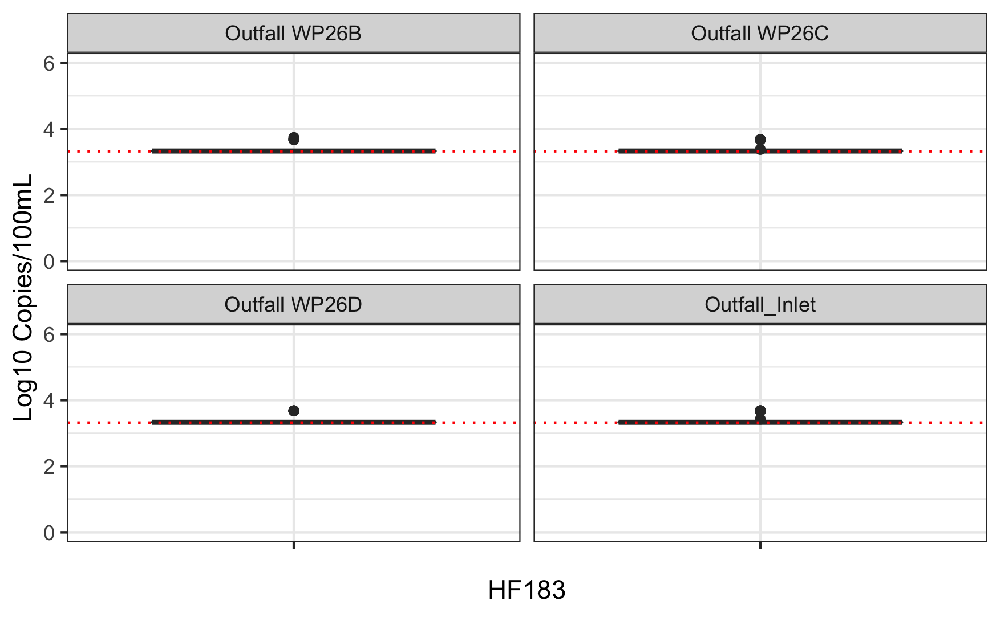

```


Temporal fluctuations in human fecal pollution markers were noted between the stormwater ponds, and among the sampling sites within a stormwater pond (*Figure below*). 
```{r warning=FALSE, fig.cap= "Temporal pattern of occurrence HF183 log10 concentrations at all sampling sites in McCall Lake (top), Country Hills (middle), and Inverness (botton) over the 21-week sampling season. The limit of quantification95 (LOQ95) as a black dotted line. The black arrows represent long holiday weekends."}
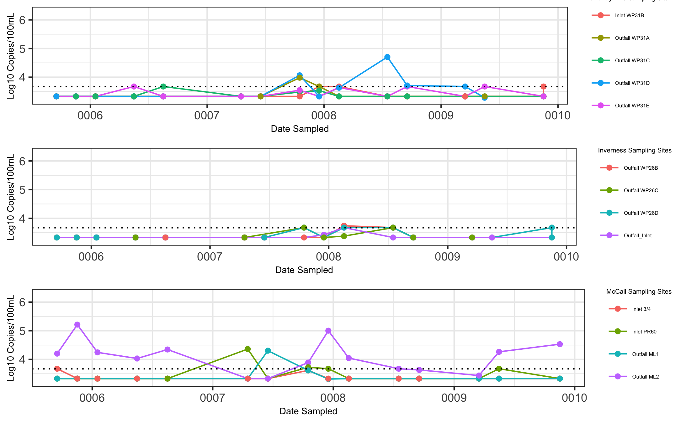
```

Of all stormwater pond sampling sites, ML2 at McCall Lake experienced the most consistent temporal pattern of human fecal contamination throughout the sampling season. For example, within the 41 sampling dates, over the 21-week sampling season, there were only two sampling dates in which we did not detect HF183 at ML2 (i.e., July 4th and August 28th) (*FIGURE ABOVE*). However, there were other sampling dates when levels of HF183 decreased to a non-quantifiable level at ML2 (i.e., May 23rd, May 25th, August 8th, and August 14th). Interestingly, this pattern tended to occur after long weekends (i.e., holidays occurring on the following Mondays: May 22nd, July 3rd, August 7th, and September 3rd), and three of these long weekends corresponded to decreases in human fecal contamination markers on the following day of sampling (i.e., May 23rd, July 4th, and August 8th, which were Tuesdays). This suspicious temporal pattern of contamination suggested that the levels of human fecal contamination may have been related to industrial/commercial activities, as the levels of human fecal contamination decreased during times when industries/commercial premises may have been closed for the holidays. 

Human fecal contamination at the sampling sites was often highly variable between sequential sampling dates. For example, at Inlet PR60 in McCall Lake, within a two-week span, biweekly HF183 values fluctuated between undetectable levels (i.e., June 29th and July 6th) and 4.3 log10 copies/100mL (i.e., July 4th) and 3.5 log10 copies/100mL (i.e., July 10th). This high variability in human fecal contamination markers over sequential sampling dates, elicits potential concerns regarding the sporadic nature of contamination and the stability of water quality in the urban stormwater ponds.

```{r warning=FALSE, fig.cap= "Temporal pattern of occurrence HuMm2 log10 concentrations at all sampling sites in McCall Lake over the 21-week sampling season. The limit of quantification95 (LOQ95) as a black dotted lines. "}
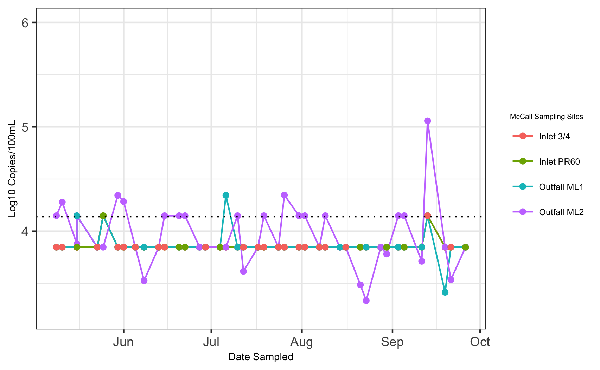
```

HumM2 was detected less frequently and at lower concentrations in all of the urban stormwater ponds tested. ML2 had the highest occurrence of HumM2 detections of all McCall Lake sampling sites, which corresponded with the findings with the human fecal contamination marker HF183 (*FIGURE ABOVE*). Furthermore, Inlet ¾ had the lowest occurrence of HF183 in McCall Lake, and was also tied for the lowest occurrence of HumM2 in McCall Lake. 

In addition to seeing temporal and spatial trends in human fecal contamination, temporal and spatial trends in seagull contamination were also noted. In McCall Lake, seagull fecal contamination was considered to be a sporadic, highly variable, source of pollution. Seagull contamination was first noted in McCall Lake at the end of June, and tended to be episodic (*FIGURE BELOW*). For example, at ML2, seagull fecal contamination was detected on July 12th and at a level of 4.1 log10 copies/100 mL, and then it was not detected at quantifiable levels again until August 8th (i.e., 3.7 log10 copies/100 mL) (*FIGURE BELOW*). Although ML2 was most frequently positive for detection of seagull fecal contamination among all sampling sites, this pattern of sporadic, highly variable findings were also noted at the other McCall Lake sites (i.e., PR60, ML1, and Inlet ¾). 

```{r warning=FALSE, fig.cap= "Temporal pattern of occurrence of LeeSg concentrations at all sampling sites in McCall Lake over the 21-week sampling season. The limit of quantification95 (LOQ95) as a blue dotted line. The black arrows represent greater than 10 mm of rain in the previous 72 hours."}
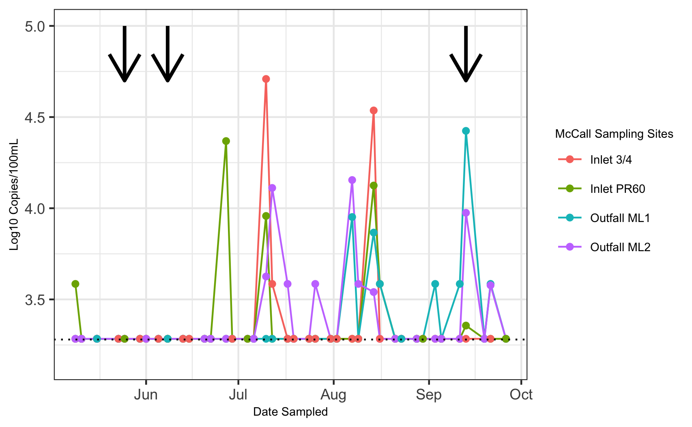
```

Overall, there were patterns of similarity in seagull contamination regarding temporal trends. These patterns were similar across the sampling sites in McCall Lake, which was noted for two key reasons. Firstly, there were three instances where seagull fecal contamination occurred concurrently at three or more McCall Lake sites (i.e., July 10th, August 14th, and September 13th). Secondly, on the aforementioned sampling dates, the levels of seagull fecal contamination detected were all within one order of magnitude of each other. These patterns suggested that a potential environmental variable linked the contamination along the sampling sites at McCall Lake. 
One potential environmental variable examined was antecedent rainfall. Only three dates (i.e., May 25th, June 8th, and September 13th) had greater than 10 mm of rain. Seagull fecal contamination was detected on only one of the sampling dates (September 13th), though at three sampling sites on this date.

A high-level descriptive overview of the frequency of several enteric bacterial pathogens (i.e., A. butzleri, Campylobacter spp., Salmonella spp., and STEC) in each of the Calgary urban stormwater ponds (i.e., McCall Lake, Country Hills Stormwater Facility, and Inverness Stormpond), and at each sampling site within the ponds is provided in *-----*. The most frequently detected bacterial pathogen found in stormwater ponds was A. butzleri, detected in 36% of samples at McCall Lake, 24% of samples at Inverness and 18% of samples at Country Hills (*-----*). The second most common pathogen detected was Campylobacter spp. (4% at Country Hills) and Salmonella spp. (1% at McCall Lake) (*-----*). 

```{r fig.cap='The frequency of occurence of the enteric bacterial pathogen A. butzleri in the Calgary, Alberta stormwater ponds.', echo=FALSE}
knitr::include_graphics("../../results/arco_pond_table.png")
```

```{r fig.cap='The frequency of occurence of the enteric bacterial pathogen Campylobacter spp. in the Calgary, Alberta stormwater ponds.', echo=FALSE}
knitr::include_graphics("../../results/campy_pond_table.png")
```

```{r fig.cap='The frequency of occurence of the enteric bacterial pathogen A. butzleri in the Calgary, Alberta stormwater ponds.', echo=FALSE}
knitr::include_graphics("../../results/salmonella_pond_table.png")
```


To better understand temporal variation, we further examined patterns of occurrence based on molecular qPCR results. Notable temporal fluctuations in A. butzleri were observed between the urban stormwater ponds, and among the sampling sites within a pond (*BELOW*). We found that at Inlet ¾, in McCall Lake, considerable temporal fluctuations were detected in the levels of A. butzleri between sequential sampling dates. Within a two-week time period (i.e., four sequential sampling dates, June 20th – June 29th), the concentration of A. butzleri varied from being not detected (i.e., below the limit of quantification of 3.5 log10 copies/100 mL) on June 20th, then spiking to 3.9 log10 copies/100 mL on June 22nd, to be not detected on June 27th, and spiking again to 4.3 log10 copies/100 mL on June 29th. 

We tracked environmental variables that could contribute to temporal fluctuations in A. butzleri concentrations (e.g., antecedent rainfall data, temperature, etc.). Of note, we recorded three sampling dates that had rainfall greater than 10 mm (i.e., May 25th, June 8th, and September 13th, Figure 5 1). We noted that A. butzleri was detected at all McCall Lake sampling sites on several sampling dates, July 10th, August 14th, August 16th, September 13th, of which September 13th had significant rainfall (Figure 5 1). However, on another rainfall date (i.e., May 25th) A. butzleri was not observed at any of the sampling sites, and on June 8th, A. butzleri concentrations reached detectable levels only at the outfalls (i.e., ML1 and ML2). 
`
```{r Temporal pattern of occurrence A. butzleri log10 concentrations at all sampling sites at Country Hills (top), Inverness (middle), and McCall Lake (bottom), over the 21-week sampling season. The limit of quantification95 (LOQ95) as a black dotted line. The black arrows represent rainfall greater than 10 mm.}
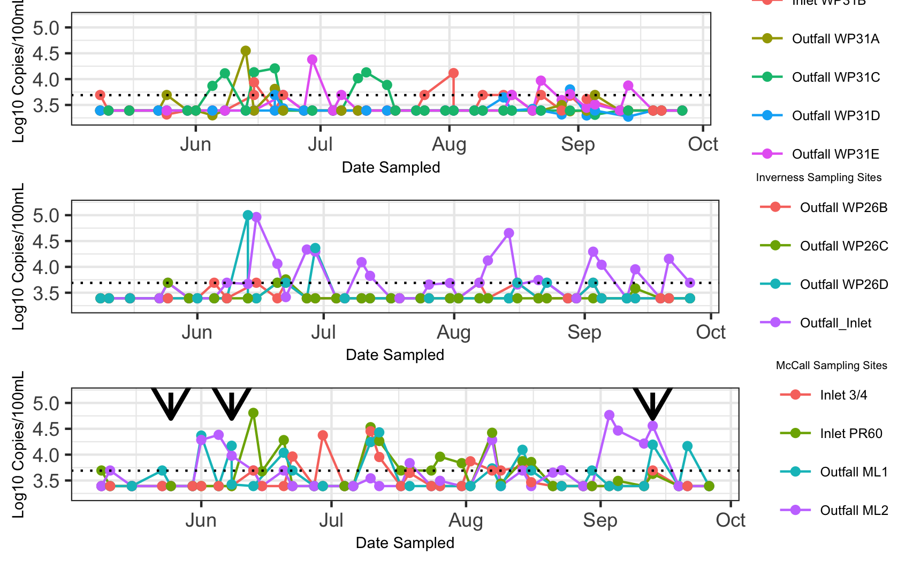
```


Due to the prevalence and abundance of A. butzleri contamination, we sought to determine the potential sources of its contamination. Water samples were analyzed by identifying which microbial source tracking markers occurred most often with A. butzleri detections. We found that the most common source of pollution co-occurring with A. butzleri detection was human fecal pollution. The human marker HF183 was the most frequently found marker with A. butzleri.  (*figure*). The second most dominant source of fecal pollution was seagull (i.e., LeeSg) (*figure*). 

```{r}
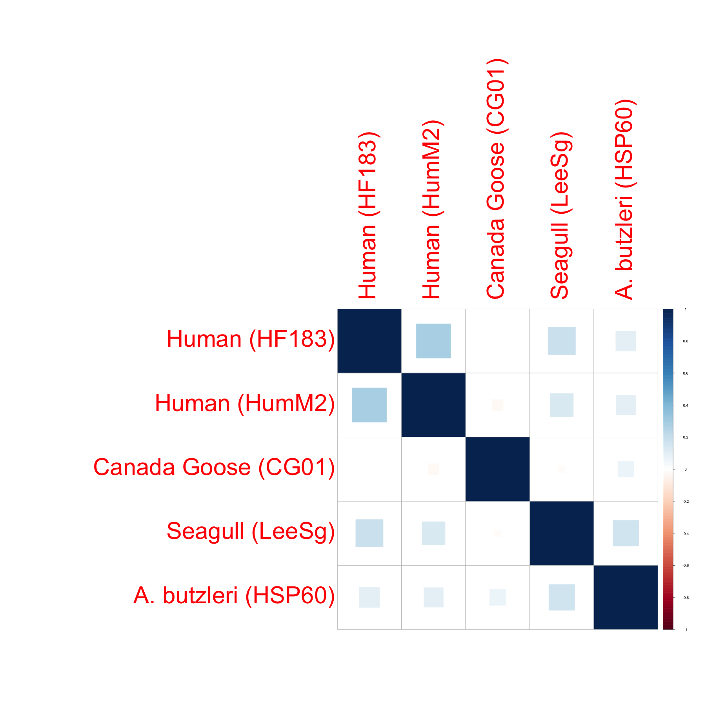
```
Several linear models were run in order to test the hypothesis that the source of fecal material in stormwater ponds would affect A. butzleri. Based on previous analyses, linear models were only run ont the most abundant microbial source tracking markers (i.e., HF183, HumM2, LeeSg, and CG01). 

```{r}
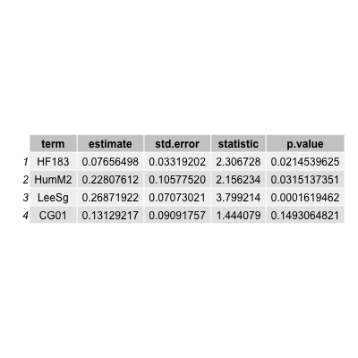
```

To further our understanding of contamination by stormwater pond, a random forest analysis was performed. Our outcome variable was the pond, and our predictors were all other variables excluding sampling site. This tree tells us if HF183 is greater than 3.9 log10 copies/100mL than the pond is McCall Lake. Based on our earlier analysis of how McCall Lake is the most conaminted sampling location by HF183, this is accurate. If HF183 is less than 3.9 log10 copies/100mL and E. coli is greater than or equal 0.87 CFU/100 mls than the pond is also contaminted with A. butzleri, otherwise the next predictor is the sampling date. If the sample has greater than 3.6 log10 copies/100mL of A. butzleri and Enterococcus levels higher than 2.5 log10 CCE/100ml than the sampling location is Country Hills. This is also reflective of the aforementioned data, as Country Hills is more contaminated than Inverness but less contaminated than McCall Lake. In addition, if A. butzleri is less than 3.6 log10 copies/100mL, than it may be contamined with seagull fecal material. This is also reflective of the aforementioned data, as we found A. butzleri to have a higher co-occurance with human fecal markers (i.e., HF183 and HumM2) than bird fecal markers (i.e., LeeSg or CG01). Following this point, our tree is further broken down by all the water quality indicators (i.e., Enterococcus, E. coli, thermotolerant coliforms).
Moving back towards the top of tree we note that the third decision point is based off of date sampled, and then thermotolerant coliforms. All of these decision points lead to Inverness. This is reflective of the previous data presented as Inverness was the least contaminated of all sampling locations. Furthermore, we find that the following decision point is total coliforms. This is unsurprising, as total coliforms are found to be abundant in recreational waters and are no longer considered to be preditors of gastroitenstinal illness when assessing water quality. As such, the US EPA has moved away from using total coliforms. Additionally, it should be noted that this half of the tree soley relies on water quality indicators and does not create nodes based off microbial source tracking markers or pathogen specific qPCR markers. This is further reflective of the results that were previously presented, as Inverness has the best water quality of all stormwater ponds tested and did not consistently have high levels of any microbial source tracking marker tested or pathogen specific qPCR marker.

```{r warning=FALSE, fig.cap= "Random forest based on the outcome of pond (i.e., McCall Lake, Inverness, Country Hills.)"}
knitr::include_graphics("../../results/pond_tree.png")
```

#Univariate Analysis 
_Use a combination of text/tables/figures to explore and describe your data. You should produce plots or tables or other summary quantities for most of your variables. You definitely need to do it for the important variables, i.e. if you have main exposure or outcome variables, those need to be explored. Depending on the total number of variables in your dataset, explore all or some of the others._

## Bivariate analysis
_Create plots or tables and compute simple statistics (e.g. t-tests, simple regression model with 1 predictor, etc.) to look for associations between your outcome(s) and each individual predictor variable_


## Full analysis
_Use one or several suitable statistical/machine learning methods to analyze your data and to produce meaningful figures, tables, etc. This might again be code that is best placed in one or several separate R scripts that need to be well documented. You can then load the results produced by this code_

# Discussion
## Summary and Interpretation
_Summarize what you did, what you found and what it means._
  To the best of our knowledge, this is the first report on the occurrence of A. butzleri in stormwater ponds. Based on direct molecular testing, A. butzleri was detected in 25% of all water samples. In addition,utilizing an integrated cell culture molecular method (i.e., MPN-qPCR assay utilizing hsp60 as our assay target) further validated our finding of A. butzleri in stormwater ponds.
  Currently, there is limited knowledge on A. butzleri in stormwater. However it has been detected in many different types of water, ranging from rivers and wells [@Wesley2000] (Wesley, et al., 2000; Fong, et al., 2007; Van Driessche & Houf, 2008) to saltwater lakes and coastal seawater (Wesley, et al., 2000; Fong, et al., 2007; Van Driessche & Houf, 2008), and even drinking water reservoirs (Wesley, et al., 2000; Van Driessche & Houf, 2008). [@Banting2016] detected A. butzleri in 54% of irrigation water samples in Alberta, Canada, through an MPN-qPCR assay, using hsp60 as their target. In addition, Webb et al. [@Banting2016] found that raw sewage had the highest density of A. butzleri in two wastewater treatment facilities in southwestern Alberta, Canada. [@Collado2010] tested 12 sampling sites along the Llobregat River in Catalonia, Spain; and at nine of the sampling sites, Arcobacter spp. was detected in 100% of samples, and at one site it was not detected in any of the samples. [@Collado2008], in their study of a fecally-contaminated freshwater stream, found the highest amount of Arcobacter spp. (i.e., 3.7 x 105 MPN/100mL) to be at the sampling location closest to the wastewater treatment.
  At individual sampling sites, concentrations of pathogens in stormwater samples occurred over a narrow range of values through culture-based methods. In our study, A. butzleri measured through culture-based methods at ML2 ranged from 0.9-93 MPN/300mL. As previously mentioned, there is limited research on the Arcobacter spp. detections through culture-based methods in stormwater; however, prior studies have found culturable levels of A. butzleri to be as high as 105 MPN/100mL in raw sewage [@Banting2016], which is considerably higher than the levels detected in our study. The finding of Arcobacter spp. in sewage or water impacted by raw sewage is not uncommon [McLellan2010] [@Collado2008] [@Khan2009]. [@Collado2008] , in their study in Spain, found the presence of A. butzleri in 58% of river water samples and in 100% of sewage samples. In addition, [@Merga2014] detected A. butzleri in 100% of domestic sewage samples in the United Kingdom. Furthermore, [@Collado2010] demonstrated that A. butzleri in urban sewage can survive treatment and therefore has the potential to be released into environmental bodies of water.
  When direct molecular methods were used, A. butzleri was detected at levels as high as 4.7 log10 genome copies/100mL at sampling site ML2. [@Webb2016] found the density of Arcobacter spp. to range from 101.5 to 104 log10 genome copies mL-1 in treated sewage by molecular-based methods with primers developed by [@Webb2016]. [@Lee2012] found the levels of A. butzleri to range from 1 x 102.7 to 1 x 105 gene copies/100mL at one Lake Erie beach over a 3-month period (i.e., July – August) through molecular-based methods using ArcoI and ArcoII primers developed by [@Bastyns1995]. The occurrence of such ranges of enteric bacterial pathogens at individual sampling sites can pose a unique challenge to the development of a stormwater treatment facility and sampling plan. 
  Understanding the spatial differences at stormwater sampling sites can allow us to better determine which sampling sites would be best suited for stormwater reuse applications. Our study revealed that some urban stormwater ponds have more consistent pathogen detections than other stormwater ponds: McCall Lake had the most A. butzleri detections, in comparison to Inverness Stormpond and Country Hills Stormwater Facility. [@Talay2016] tested 115 different water samples (i.e., sewage, rivers, spring water, and drinking water) by molecular-based methods from Izmir Turkey. They found that the prevalence of Arcobacter spp. was highest in river water (i.e., 52% of samples), and that all drinking water samples were negative [@Talay2016]. [@Webb2016] in their testing of two different wastewater treatment plants in southwestern Alberta, Canada, found higher densities of A. butzleri in the Lethbridge wastewater treatment plant than in the Fort Macleod treatment plant through molecular-based methods. 
     Moreover, differences in methods may not be only variable affecting A. butzleri occurrences and concentrations. A study by [@Fera2010] indicated that Arcobacter spp. may survive better at lower temperatures. [@Lee2012] found that Arcobacter spp. detections in recreational water was higher in September at Lake Erie in North America, and suggested that the levels show a negative correlation with the temperature of the water through molecular methods. Conversely, [@Webb2016] reported lower densities of A. butzleri in December and March from samples from wastewater treatment plants located in southwestern Alberta, Canada, by molecular-based methods. However, some studies did not find a seasonal effect on enteric pathogens [@Rechenbrug2009]. That said, environmental variables are not the only factor influencing enteric bacterial pathogens in stormwater-impacted bodies of water.
## Strengths and Limitations
_Discuss what you perceive as strengths and limitations of your analysis._
      Our study focused on molecular-based methods for the identification of A. butzleri, in addition to other pathogens and microbial source tracking markers in urban stormwater ponds. Molecular-based methods are fast, less labor-intensive and can be less biased than culture-based methods. Using molecular-techniques allowed us to assess ~800 samples for a wide vareity of microbial sources of fecal polution, enteric bacterial pathogens, and water quality indicators. Furthermore, this study entailed the entire time from thaw to freeze, when stormwater poses a risk to human health and a potential reuse opporuntity. Having a long sampling season, ina addition to obtaining samples biweekely allowed us to fully assess temporal trends. Additionally, by assessing a variety of stormwater ponds we were able to gather a deeper understanding of water quality issues facing urban stormwater ponds in Alberta.
      Although molecular-based methods provide a lot of infomration, these culture-independant techniques do not differentiate between living and dead cells. As such, other studies have found molecular methods to underestimate A. butzleri prevelance by as much as 50% (Beaudry et al., unpublished) when comparing to culture-based methods. As such, the prevelance of A. butzleri in this paper may be widely underestimated, and may be as high as 75%. Furthermore, qPCR methods do not provide us with any information on the physiological state or activities of the bacterium, which could be further studied using metatranscriptomics or culture-methods. In addition, as A. butzleri is a putative pathogen future work needs to be done in order to determine the bacteriums pathogenic potential. For this research specifically, any isolates of A. butzleri obtained could be tested for virulence genes using homologs of those found in Campylobacter spp.
      
## Conclusions
_What are the main take-home messages?_
Our study found that A. butzleri was the most common pathogen present; and a growing number of researchers are suggesting that the clinical prevalence of the Arcobacter species is probably underestimated since the species is not routinely tested for [@Levican2013] [@Douidah2011] and primers that have been used to identify Campylobacter spp. cross react with Arcobacter spp. [@Banting2016]. Further, our study reflected that the A. butzleri found in stormwater ponds harbors many virulence genes regardless of source of fecal contamination, and should therefore be treated as pathogenic. The prevalence and levels of A. butzleri need to be taken into consideration when developing an urban stormwater sampling plan and stormwater treatment.


_Include citations in your Rmd file using bibtex, the list of references will automatically be placed at the end_

# References

