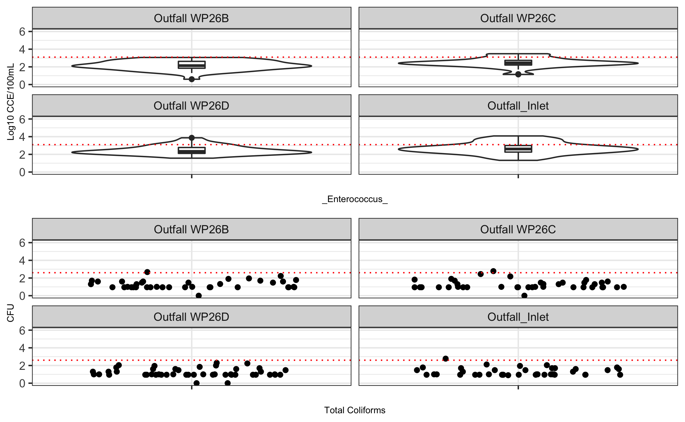
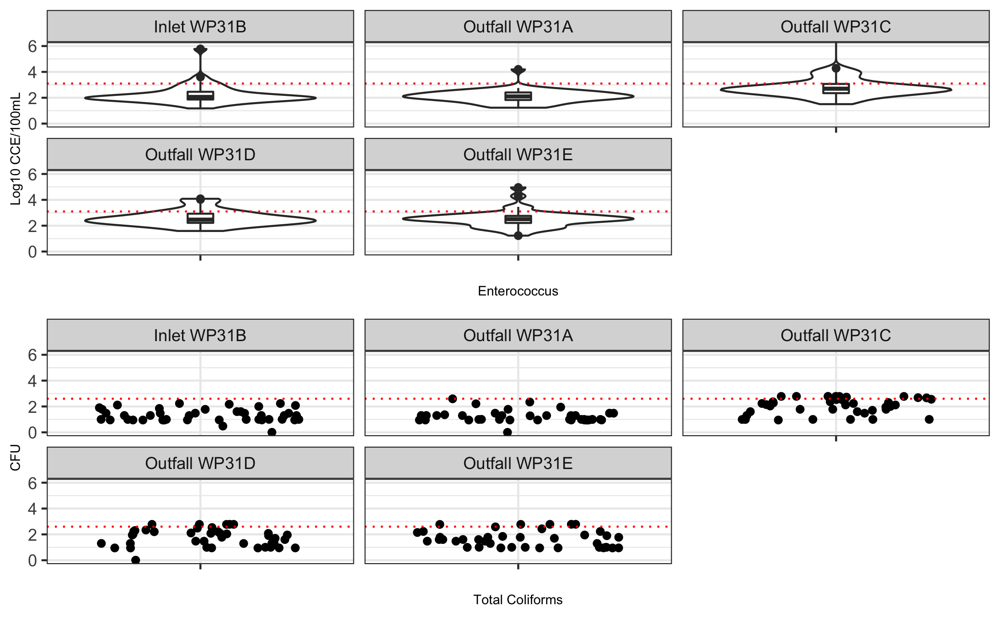
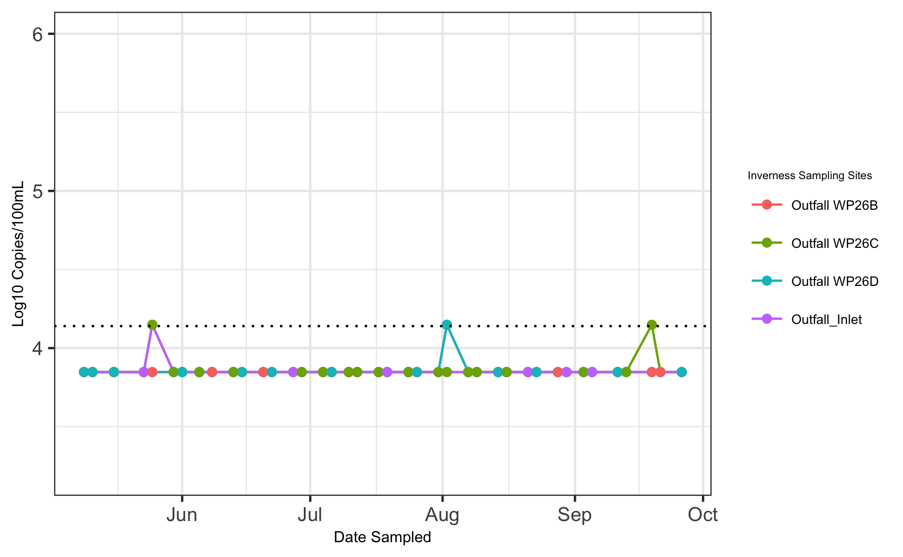
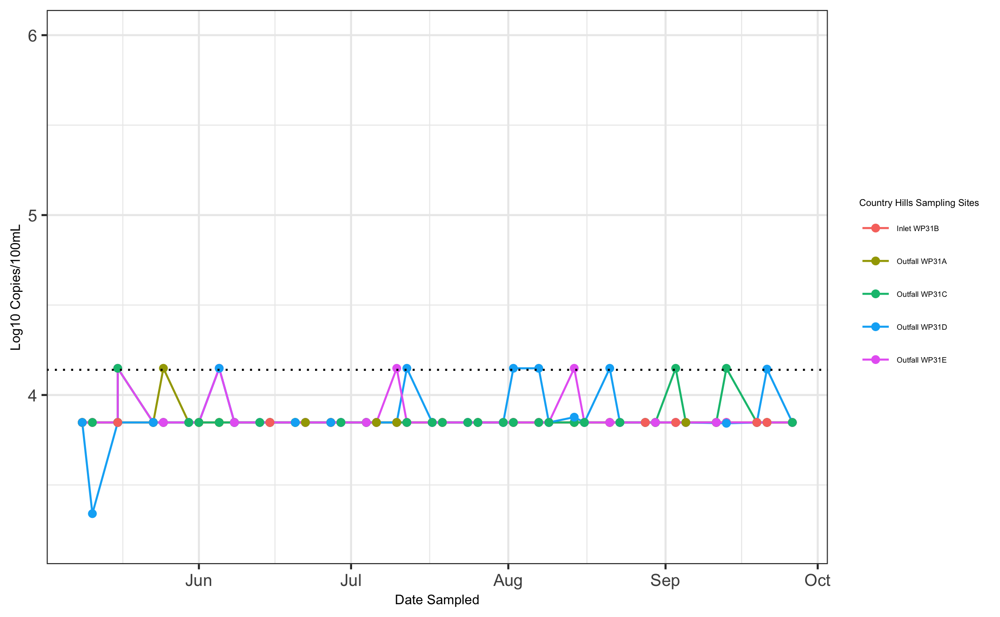
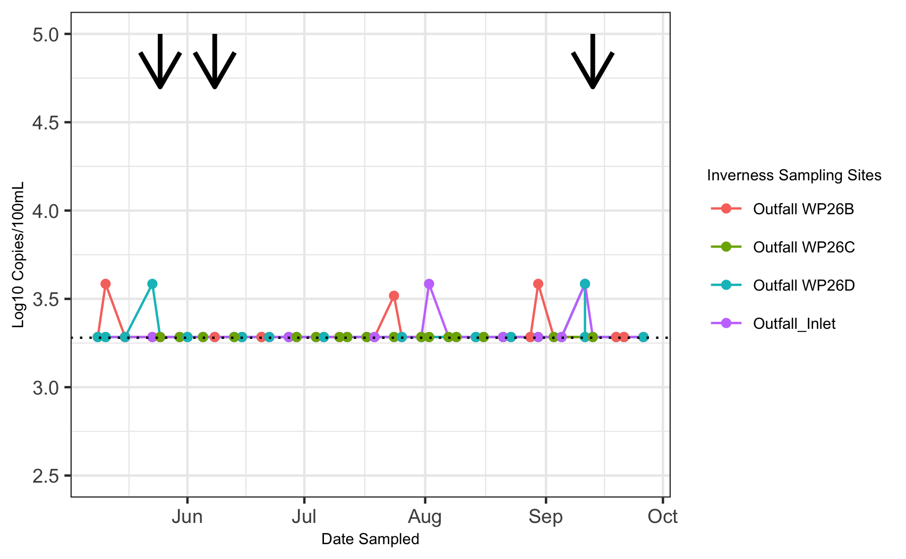
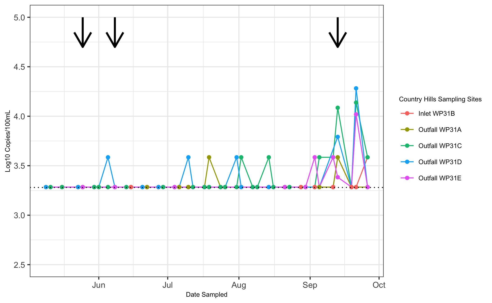

```{r setup, include=FALSE}
knitr::opts_chunk$set(echo = TRUE)
```


# __Supplemental Material__


## Thermotolerant Coliform Counts
Figure 1 provides a high level overview of the thermotolerant coiform counts of the stormwater ponds in Calgary, Alberta. Similar spatial variation was observed in these results that were found with _Enterococcus_ spp.

```{r warning=FALSE, echo=FALSE, fig.cap= "Frequency of occurrence of samples positive based on the water quality indicator thermotolerant coliforms of stormwater ponds in Calgary, Alberta."}
knitr::include_graphics("../../results/thermo_pond_table.png")
```

Figure 2 provides a high level overview of the thermotolerant coiform counts of the stormwater pond sampling site in Calgary, Alberta. Similar spatial variation was observed in these results that was found when using _Enterococcus_ spp. as the water quality indicator. 

```{r warning=FALSE, echo=FALSE, fig.cap= "Frequency of occurrence of samples positive based on water quality indicator thermotolerant colifroms broken down by sampling site in Calgary, Alberta."}
knitr::include_graphics("../../results/thermo_y_n_site_table.png")
```


## Water quality by sampling site and pond 

Figure 3 provides information regarding the overall trends in water quality in Inverness (Figure 3) and Country Hills (Figure 4). The water quality in Inverness and Country Hills appeared to be better than McCall Lake, when measured by _Enterococcus_ spp. or thermotolerant coliforms. 

```{r warning=FALSE, echo=FALSE, fig.cap= "Violin  plot of _Enterococcus_ log10 values (top) and scatterplot ofthermotolerant coliforms log10 (bottom) values in Inverness Stormwater Facility over 21 weeks broken down by sampling site (i.e., Outfall WP26B, Outfall Wp26C, Outfall Wp26D, Outfall/Inlet). The red dotted line respresents the USEPA guidelines for recreational water quality STV (top) and Alberta Environments thermotolerant coliform guideline (below)"}

```


```{r warning=FALSE, echo=FALSE, fig.cap= "Violin  plot of _Enterococcus_ log10 values (top) and scatterplot ofthermotolerant coliforms log10 (bottom) values in Country Hills Stormwater Pond over 21 weeks broken down by sampling site (i.e., Outfall WP26B, Outfall Wp26C, Outfall Wp26D, Outfall/Inlet). The red dotted line respresents the USEPA guidelines for recreational water quality STV (top) and Alberta Environments thermotolerant coliform guideline (below)"}

```


# Microbial Source Tracking by Pond
Four microbial source tracking markers (i.e,. HF183, HumM2, CG01, LeeSg) were found to be more dominant sources of contamination in the Calgary. Specific percentages for the frequency of occurance are listed in tables below. 
```{r warning=FALSE, echo=FALSE, fig.cap= "Frequency of occurrence of samples positive based on MST marker HF183 for human fecal contamination broken down by sampling site in Calgary, Alberta."}
knitr::include_graphics("../../results/HF183_y_n_pond_table.png")
```


```{r warning=FALSE, echo=FALSE, fig.cap= "Frequency of occurrence of samples positive based on MST marker HuMm2 for human fecal contamination broken down by sampling site in Calgary, Alberta."}
knitr::include_graphics("../../results/HumM2_y_n_pond_table.png")
```


```{r warning=FALSE,echo=FALSE, fig.cap= "Frequency of occurrence of samples positive based on MST marker CG01 for human fecal contamination broken down by sampling site in Calgary, Alberta."}
knitr::include_graphics("../../results/CG01_y_n_pond_table.png")
```


```{r warning=FALSE, echo=FALSE, fig.cap= "Frequency of occurrence of samples positive based on MST marker LeeSg for human fecal contamination broken down by sampling site in Calgary, Alberta."}
knitr::include_graphics("../../results/LeeSg_y_n_pond_table.png")
```


Three microbial source tracking markers (Dog3, Rum2Bac, MuBac) were found in less than 5% of samples of all Calgary stormwater pond samples, and therefor were not considered dominant sources of fecal pollution. 
 
 

```{r warning=FALSE,echo=FALSE, fig.cap= "Frequency of occurrence of samples positive based on MST marker Dog3 for human fecal contamination broken down by sampling site in Calgary, Alberta."}
knitr::include_graphics("../../results/Dog3_y_n_pond_table.png")
```


```{r warning=FALSE,echo=FALSE, fig.cap= "Frequency of occurrence of samples positive based on MST marker Rum2Bac for human fecal contamination broken down by sampling site in Calgary, Alberta."}
knitr::include_graphics("../../results/Rum2Bac_y_n_pond_table.png")
```


```{r warning=FALSE,echo=FALSE, fig.cap= "Frequency of occurrence of samples positive based on MST marker MuBac for human fecal contamination broken down by sampling site in Calgary, Alberta."}
knitr::include_graphics("../../results/MuBac_y_n_pond_table.png")
```

## Human Fecal Contamination by Pond
All sampling sites detected human fecal contamination from the marker HF183. The box and whisper plots (*BELOW*) indicate the levels of HF183 found within Country Hills and Inverness, which had lower leves than McCall Lake. 


```{r warning=FALSE, echo=FALSE, fig.cap= "Box and Whisker Plot of HF183 levels by sampling site in Country Hills. The outer edges of the box represent the 25th and 75th percentiles (i.e., interquartile range), and the line within the box represents the median. The location of median indicates the skew of the data. The whiskers represent the interquartile range*1.5. The outliers are determined by being greater or less than 1.5 times the upper of lower interquartile ranges as represented by circles."}
knitr::include_graphics("../../results/Country_Hills_bysite_box_HF183.png")
```


```{r warning=FALSE,echo=FALSE, fig.cap= "Box and Whisker Plot of HF183 levels by sampling site in Inverness. The outer edges of the box represent the 25th and 75th percentiles (i.e., interquartile range), and the line within the box represents the median. The location of median indicates the skew of the data. The whiskers represent the interquartile range*1.5. The outliers are determined by being greater or less than 1.5 times the upper of lower interquartile ranges as represented by circles."}
knitr::include_graphics("../../results/Inverness_bysite_box_HF183.png")

```


## HumM2 (human fecal material) at Inverness and Country Hills

HumM2 was detected far less frequently in Inverness and Country Hills than McCall Lake. 

```{r warning=FALSE, echo=FALSE, fig.cap= "Temporal pattern of occurrence HuMm2 log10 concentrations at all sampling sites in Inverness Lake over the 21-week sampling season. The limit of quantification95 (LOQ95) as a black dotted lines."}

```


```{r warning=FALSE, echo=FALSE, fig.cap= "Temporal pattern of occurrence HuMm2 log10 concentrations at all sampling sites in Country Hills over the 21-week sampling season. The limit of quantification95 (LOQ95) as a black dotted lines."}

```


## Seagull Contamination
Seagull contamination was found the most often in McCall Lake. However, it was also detected towards the end of the season in Country Hills and Inverness.

```{r warning=FALSE, echo=FALSE, fig.cap= "Temporal pattern of occurrence of LeeSg concentrations at all sampling sites in Invernesss over the 21-week sampling season. The limit of quantification95 (LOQ95) as a blue dotted line. The black arrows represent greater than 10 mm of rain in the previous 72 hours."}

```

```{r warning=FALSE, echo=FALSE, fig.cap= "Temporal pattern of occurrence of LeeSg concentrations at all sampling sites in Country Hills over the 21-week sampling season. The limit of quantification95 (LOQ95) as a blue dotted line. The black arrows represent greater than 10 mm of rain in the previous 72 hours."}

```


