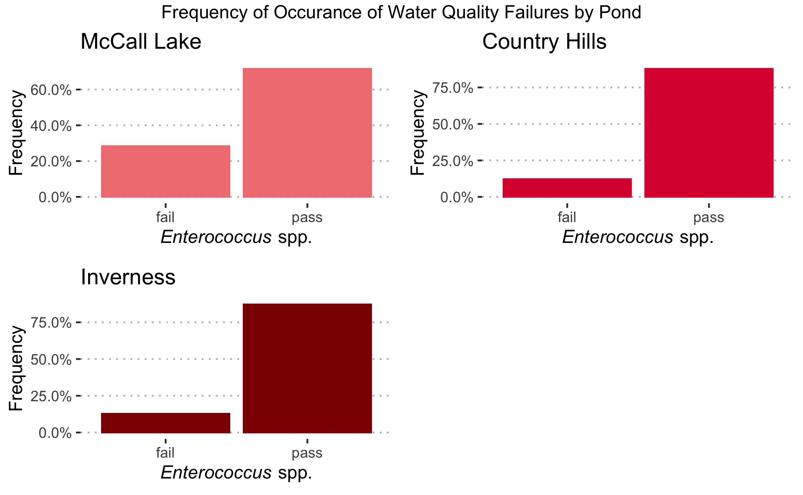
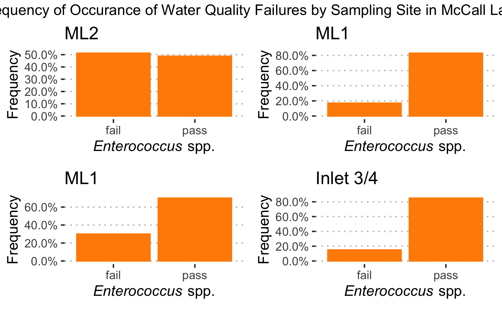
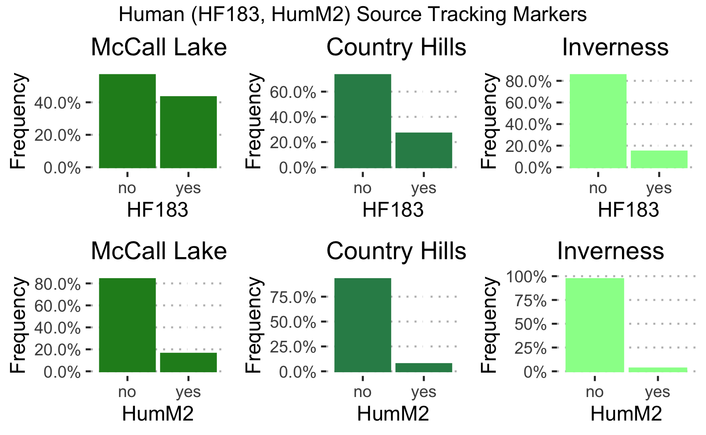
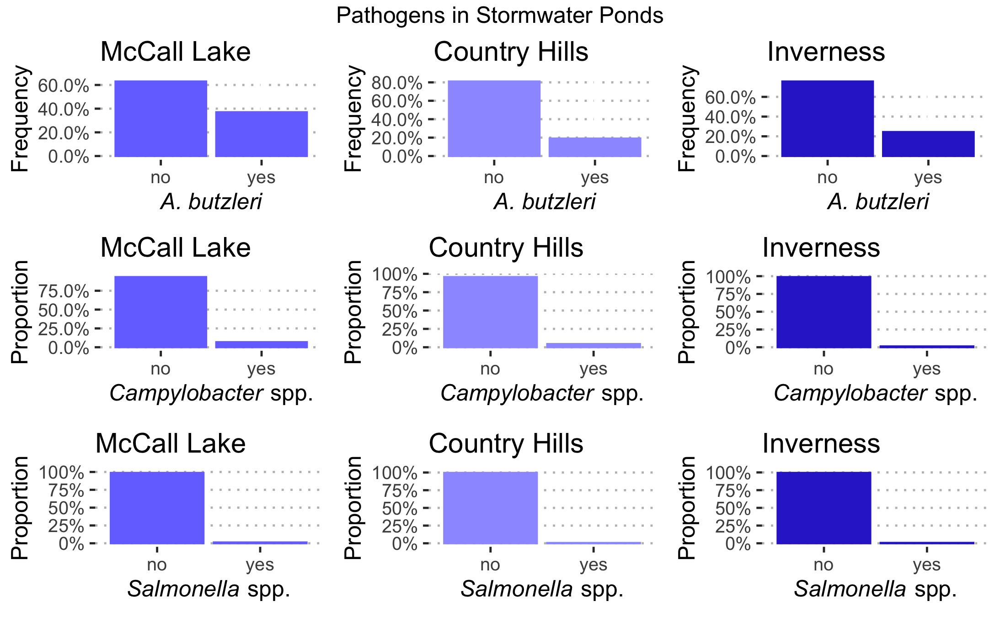

## From Nuisance to Resource: Understanding Bacterial and Microbial Sources of Contamination in Urban Stormwater-Impacted Bodies of Water

Megan Beaudry

## Overview
1. Introduction

2. Sampling- Where do I get stormwater? 

3. Methods- How do we analyze stormwater?  

4. Results-
Water Quality
Microbial Source Tracking
Enteric Bacterial Pathogens

5. Conclusion - What does this mean for stormwater- impacted bodies of water?

## Stormwater is not Rainwater!

Stormwater is precipitation collected after reaching the ground.

Urban stormwater -  runoff that is created by the increase in impervious surfaces that occur in urban environments
Stormwater ponds collect excess runoff in cities to control flooding and manage urban pollution.

Harvesting stormwater could provide Alberta with a strategy to address the growing demands on water resources due to climate change and projected population growth. 

From nuisance to resource!

## Stormwater Use Options

Watering community gardens

Watering athletic fields

Water features

Toilet/urinal flushing

Clothes washing

Fire fighting 

## Why can't we just use the water?
Potential contaminants:  

Microbial pathogens from human and animal feces

Helminths, protozoa, viruses, chemicals

Storm events have been linked to an increased incidence of waterborne enteric diseases, largely due to mobilization and transport of pathogens. 

## What knowledge gaps do these research objectives help fill?
Public health risks associated with stormwater reuse are not well understood.

This study is the first of its kind to characterize _A. butzleri_ in the urban stormwater-impacted bodies of water in western Canada.

Provide information that will help public health officials develop a stormwater monitoring program for the province: 
Sampling frequency
Indicator organism(s)
Assessment criteria

## Overview
2. Sampling- Where do I get stormwater? 

## Collection of Stormwater Pond Samples
All samples were taken through the “grab sampling” method. 

Three stormwater ponds were samples in the City of Calgary, with number of inlets/outlets ranging from 4-5. Each pond was sampled twice a week over 21 weeks resulting in 533 samples.

All 3 of these ponds were investigated, however due to time constraints we are going to focus on McCall Lake today.

## Molecular Methods
1. Filter 20mL water through a 0.4 µm filter to capture bacteria

2. Extract DNA from filter (EPA Method 1611)
          OR
Culture 100 mL of water in Quantitrays® with Colilert® for E. coli detection (24 h) and DNA extracted from _E. coli_ positive wells

3. Quantitative Polymerase Chain Reaction (qPCR)

## Overview

3. Results

## Water Quality by Pond

```{r out.width = "60%",  fig.cap= "Frequency of occurrence of samples positive based on water quality indicator _Enterococcus_ spp. in stormwater ponds in Calgary, Alberta.", echo=FALSE}

```

## What about indivdiual sampling sites within a pond?


```{r out.width = "60%", fig.cap= "Frequency of occurrence of samples positive based on water quality indicator _Enterococcus_ spp. broken down by sampling site at McCall Lake in Calgary, Alberta.", echo=FALSE}

```

## Water Quality Key Points
Stormwater-impacted bodies of water often FAIL existing water quality guidelines

Why is the water failing recreational water guidelines? 

## What are contributors to the pond?

qPCR Targets: Microbial Source Tracking

Human (HF183, HumM2)

Dog (Dog3)

Canada Gose (CG01)

Seagull (LeeSg)

Ruminant (Rum2Bac)

Muskrat (MuBac)
 
## What is the most dominant source of pollution?

```{r out.width = "60%", fig.cap= "Frequency of occurrence of samples positive based on MST marker HF183 and HumM2 for human fecal contamination broken down by sampling site in Calgary, Alberta.", echo=FALSE}

```

## Is there one site that is frequently contaminated with human fecal contamination?

```{r out.width = "60%", fig.cap= "McCall Lake box and whiskplot of HF183 contamination.", echo=FALSE}
knitr::include_graphics("../../results/McCall_bysite_box_HF183.png")
```

## Well, what are the patterns of human fecal contamination?

Key Points:
High frequency, high levels
ML2 is more consistently contaminated than other sampling sites
Decreases in human fecal contamination occur after long weekends
The highest level of human fecal contamination occur in conjunction with rainfall

```{r out.width = "60%", fig.cap= "Temporal pattern of occurrence HF183 log10 concentrations at all sampling sites in McCall Lake (top), Country Hills (middle), and Inverness (bottom).", echo=FALSE}
knitr::include_graphics("../../results/HF183_all_arranged.png")
```

## What in the pond could be a risk to human health?
qPCR Targets: Pathogens

_Camyplobacter__ spp.
_Arcobacter butzleri_
_Salmonella_ spp.
STEC

## So, what pathogens do we detect most often?

```{r out.width = "60%", echo=FALSE}

```

## What are the potential sources of contamination? 

````{r out.width = "40%", fig.cap = "Correlation plot of potential sources of A. butzleri.", echo=FALSE}
knitr::include_graphics("../../results/corrplot_arco_human_bird.png")
```

## Conclusions

Overall water quality of stormwater-impacted bodies of water often FAILED existing water quality guidelines.

There were two dominant microbial sources of fecal pollution:
Human
Seagull

Of the four enteric bacterial pathogens tested, A. butzleri was the most dominant.

_A. butzleri_ has the potential to be virulent 

## References


